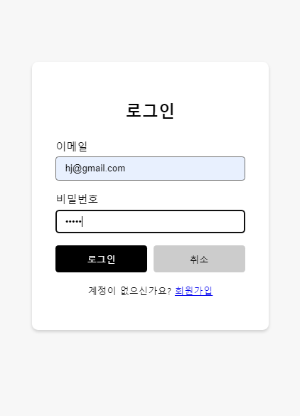
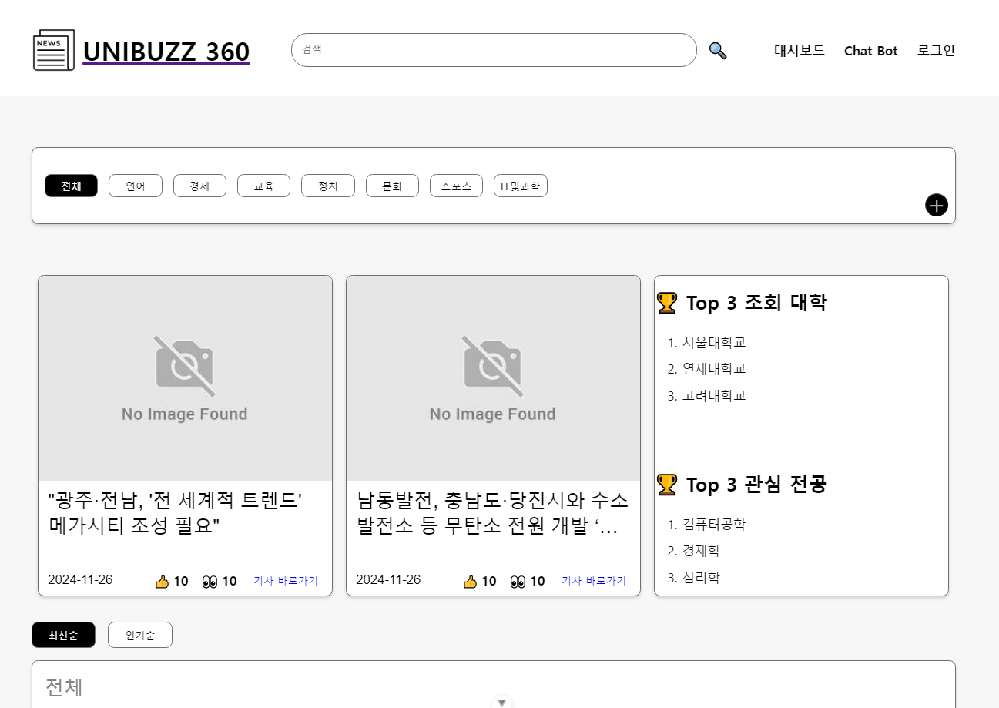
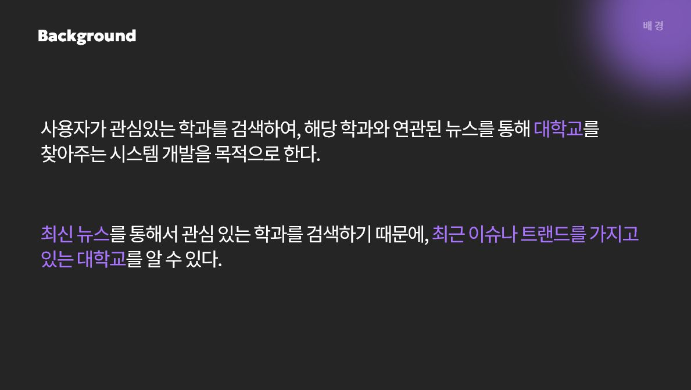
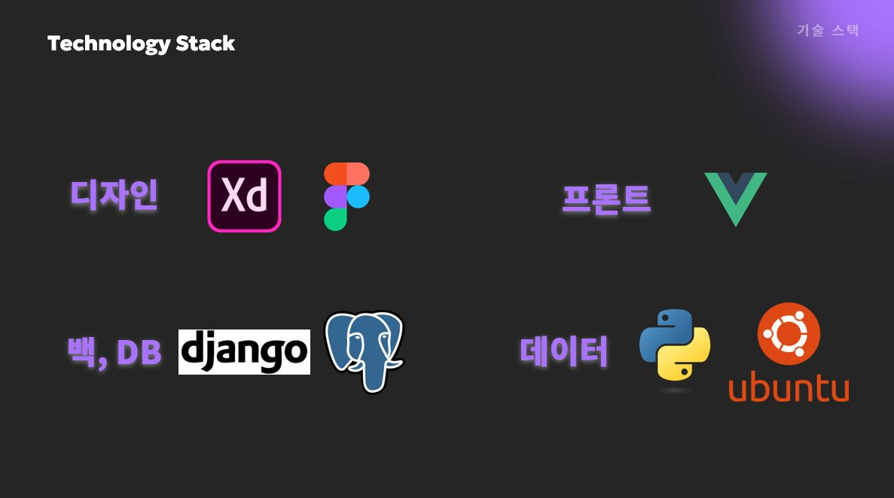
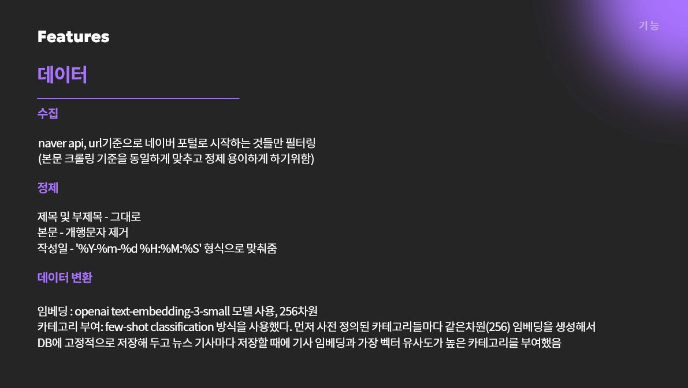
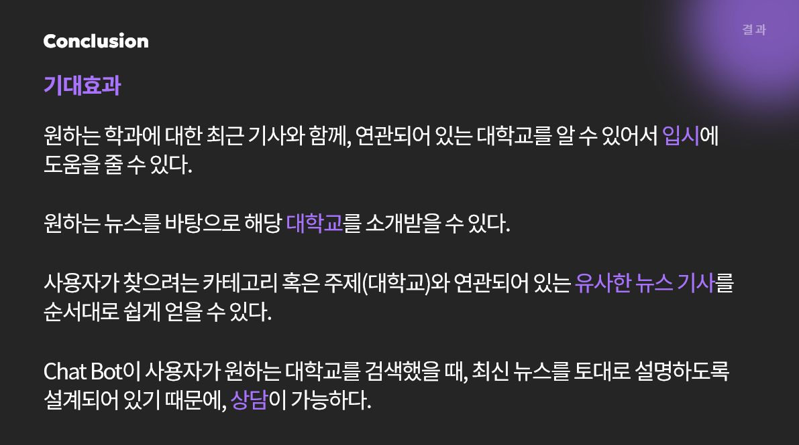

# Unibuzz360: 뉴스 기사 기반 대학 추천 서비스

## Usage

본 프로젝트는 postgresql4 데이터베이스를 활용하는 django 기반 백엔드와 
Vue 기반 프론트엔드로 구성된 서비스입니다. 서버를 실행시키기 위해서 다음 명령을 실행합니다.

1. 필요 패키지 설지
```
poetry install #poetry 의존성 관리자를 이용해 파이썬 라이브러리들 설치
cd frontend
npm install #package-lock.json 상의 node modules 설치
```
2. 실시간으로 대학 기사를 수집하는 명령어 - 다음 명령어를 실행하면 최신 기사 200개가 수집되어 DB에 저장됩니다.
```
cd backend
python manage.py crawl_news
```
3. 각 기사에 대한 zero-shot category classification을 위해서, 카테고리 단어별 임베딩을 초기화하는 작업이 필요합니다.
```
cd backend
python manage.py init_category_embedding
```
4. Django 서버 실행 
```
cd backend
python manage.py runserver
```

5. Vue 프로젝트 실행
```
cd frontend
npm run dev
```
접속 url: 

#### 제공 기능

로그인



**메인 화면**: 수집된 최신 기사들을 카테고리별로 조회해 볼 수 있습니다.



**뉴스 목록**: 메인 페이지의 하단 뉴스 목록들에는 기사별 중심 핵심 키워드 5개가 추출되어 보여집니다.

.png)
.png)

관심 학과 검색어를 입력하면 보이는 검색 결과 페이지입니다.

.png)

개별 기사 페이지로, 상단에 카테고리와 해당 기사에 언급되는 대학(학과) 명이 표시됩니다. 우측에는 현재 기사와 가장 유사한 5개의 다른 기사들입니다. (추천 알고리즘)

.png)

챗봇 - 입시 관련 상담 챗봇입니다. 사용자가 관심 학교에 관한 내용을 질문하면 RAG 방식으로 관련 뉴스를 참조해 답변합니다.

.png)







### 추후 개선해 볼 부분
1. Hadoop File System으로 대용량의 기사를 저장하는 방식으로 수정
2. Spark streaming으로 실시간 데이터 처리
3. 사용자 맞춤 데이터 분석 (유저의 관심사를 관리하는 테이블 추가)
4. 감정 분석이 가능하도록 하여, 긍정과 부정 여론을 분석 후, 해당 뉴스에서 대학 추천도를 보여주는 기능
5. 좋아요와 조회수 업데이트 기능
